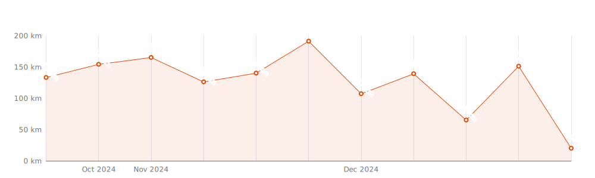
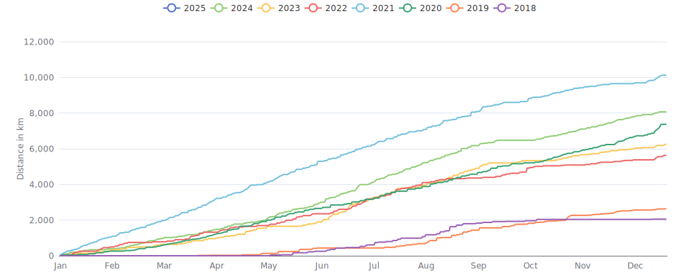

    

Since I began cycling `7 years and 1 month` ago on `06-05-2018`,
I had `876 cycling days`. 
I recorded a total distance of `40 962 km`
(`1.02` trips around the world 🌍 and
`0.107` trips to the moon 🌕),
an elevation of `453 130 m`
(`51.2` times Mount Everest 🏔)
and a total time of `2mos 1w 1d 12h 36m` 🎉

That's a daily average of `17 km`,
a weekly average of `120 km` and a
monthly average of `519 km` 🐣

I burned `1047690 calories` doing so, that's about `3 880` pizza slices 🍕

---

<kbd><a href="#weekly-distances">Weekly distances</a></kbd> |
<kbd><a href="#activities">Activities</a></kbd> |
<kbd><a href="#monthly-stats">Monthly stats</a></kbd> |
<kbd><a href="#activity-intensity">Activity intensity</a></kbd> |
<kbd><a href="#stats-per-weekday">Stats per weekday</a></kbd> |
<kbd><a href="#daytime-stats">Daytime stats</a></kbd> |
<kbd><a href="#stats-per-bike">Stats per bike</a></kbd> |
<kbd><a href="#best-power-outputs-over-time">Power outputs</a></kbd> |
<kbd><a href="#eddington-chart">Eddington</a></kbd> |
<kbd><a href="#yearly-distances">Yearly distances</a></kbd> |
<kbd><a href="#distance-breakdown">Distance breakdown</a></kbd> |
<kbd><a href="#challenge-consistency">Challenge consistency</a></kbd> |
<kbd><a href="#completed-challenges">Completed challenges</a></kbd>

## Weekly distances

## Activities

<table>
    <tr>
        <th></th>
        <th></th>
        <th align="center"></th>
        <th align="center"></th>
        <th align="center"></th>
        <th align="center"></th>
        <th align="center"></th>
        <th align="center"></th>
    </tr>
            <tr>
            <td>24-11-24</td>
            <td>
                                
<a href="https://www.strava.com/activities/12975093362" title="Kcal: 1293 | Gear: Kickr ">Race: VirtuSlo 4Endurance</a>
            </td>
            <td align="center">49 km</td>
            <td align="center">477 m</td>
            <td align="center">1:15:53</td>
            <td align="center">273 w</td>
            <td align="center">39 km/h</td>
            <td align="center">157</td>
        </tr>
            <tr>
            <td>22-11-24</td>
            <td>
                
<a href="https://www.strava.com/activities/12958180845" title="Kcal: 332 | Gear: Kickr ">Wahoo SYSTM: Bavaria: Burg...</a>
            </td>
            <td align="center">13 km</td>
            <td align="center">0 m</td>
            <td align="center">25:28</td>
            <td align="center">217 w</td>
            <td align="center">31.4 km/h</td>
            <td align="center">137</td>
        </tr>
            <tr>
            <td>21-11-24</td>
            <td>
                
<a href="https://www.strava.com/activities/12951704537" title="Kcal: 952 | Gear: Kickr ">Wahoo SYSTM: On Location -...</a>
            </td>
            <td align="center">37 km</td>
            <td align="center">0 m</td>
            <td align="center">1:05:32</td>
            <td align="center">242 w</td>
            <td align="center">33.6 km/h</td>
            <td align="center">144</td>
        </tr>
            <tr>
            <td>20-11-24</td>
            <td>
                
<a href="https://www.strava.com/activities/12944557154" title="Kcal: 1021 | Gear: Kickr ">Wahoo SYSTM: On Location -...</a>
            </td>
            <td align="center">41 km</td>
            <td align="center">0 m</td>
            <td align="center">1:13:11</td>
            <td align="center">232 w</td>
            <td align="center">33.2 km/h</td>
            <td align="center">138</td>
        </tr>
            <tr>
            <td>17-11-24</td>
            <td>
                                
<a href="https://www.strava.com/activities/12924085045" title="Kcal: 623 | Gear: Kickr ">Race: Community Racing Fes...</a>
            </td>
            <td align="center">24 km</td>
            <td align="center">141 m</td>
            <td align="center">34:48</td>
            <td align="center">293 w</td>
            <td align="center">40.9 km/h</td>
            <td align="center">168</td>
        </tr>
        </table>

    
Older activities

    <table>
        <tr>
            <th></th>
            <th></th>
            <th align="center"></th>
            <th align="center"></th>
            <th align="center"></th>
            <th align="center"></th>
            <th align="center"></th>
            <th align="center"></th>
        </tr>
                    <tr>
                <td>16-11-24</td>
                <td>
                    
<a href="https://www.strava.com/activities/12910897730" title="Kcal: 928 | Gear: Kickr ">Wahoo SYSTM: The Shovel</a>
                </td>
                <td align="center">39 km</td>
                <td align="center">0 m</td>
                <td align="center">1:13:56</td>
                <td align="center">209 w</td>
                <td align="center">31.5 km/h</td>
                <td align="center">144</td>
            </tr>
                    <tr>
                <td>14-11-24</td>
                <td>
                    
<a href="https://www.strava.com/activities/12901559799" title="Kcal: 690 | Gear: Kickr ">Wahoo SYSTM: Bavaria: Ober...</a>
                </td>
                <td align="center">29 km</td>
                <td align="center">0 m</td>
                <td align="center">55:26</td>
                <td align="center">207 w</td>
                <td align="center">31.6 km/h</td>
                <td align="center">129</td>
            </tr>
                    <tr>
                <td>13-11-24</td>
                <td>
                    
<a href="https://www.strava.com/activities/12891888962" title="Kcal: 735 | Gear: Kickr ">Wahoo SYSTM: ALL Access EF...</a>
                </td>
                <td align="center">34 km</td>
                <td align="center">0 m</td>
                <td align="center">1:09:32</td>
                <td align="center">176 w</td>
                <td align="center">29.7 km/h</td>
                <td align="center">120</td>
            </tr>
                    <tr>
                <td>10-11-24</td>
                <td>
                    
<a href="https://www.strava.com/activities/12864641265" title="Kcal: 658 | Gear: Kickr ">Wahoo SYSTM: The Trick</a>
                </td>
                <td align="center">29 km</td>
                <td align="center">0 m</td>
                <td align="center">57:54</td>
                <td align="center">189 w</td>
                <td align="center">30.2 km/h</td>
                <td align="center">126</td>
            </tr>
                    <tr>
                <td>09-11-24</td>
                <td>
                    
<a href="https://www.strava.com/activities/12856605316" title="Kcal: 834 | Gear: Kickr ">Wahoo SYSTM: FTP Progressi...</a>
                </td>
                <td align="center">34 km</td>
                <td align="center">0 m</td>
                <td align="center">1:03:00</td>
                <td align="center">221 w</td>
                <td align="center">32.3 km/h</td>
                <td align="center">136</td>
            </tr>
                    <tr>
                <td>08-11-24</td>
                <td>
                    
<a href="https://www.strava.com/activities/12852812235" title="Kcal: 907 | Gear: Kickr ">Wahoo SYSTM: FTP Progressi...</a>
                </td>
                <td align="center">35 km</td>
                <td align="center">0 m</td>
                <td align="center">1:07:16</td>
                <td align="center">226 w</td>
                <td align="center">30.8 km/h</td>
                <td align="center">135</td>
            </tr>
                    <tr>
                <td>07-11-24</td>
                <td>
                    
<a href="https://www.strava.com/activities/12846683982" title="Kcal: 891 | Gear: Kickr ">Wahoo SYSTM: ProRides: UAE...</a>
                </td>
                <td align="center">35 km</td>
                <td align="center">0 m</td>
                <td align="center">1:03:07</td>
                <td align="center">235 w</td>
                <td align="center">33.2 km/h</td>
                <td align="center">147</td>
            </tr>
                    <tr>
                <td>05-11-24</td>
                <td>
                    
<a href="https://www.strava.com/activities/12825932192" title="Kcal: 842 | Gear: Kickr ">Wahoo SYSTM: Defender</a>
                </td>
                <td align="center">33 km</td>
                <td align="center">0 m</td>
                <td align="center">58:56</td>
                <td align="center">238 w</td>
                <td align="center">33.4 km/h</td>
                <td align="center">142</td>
            </tr>
                    <tr>
                <td>03-11-24</td>
                <td>
                    
<a href="https://www.strava.com/activities/12809893371" title="Kcal: 952 | Gear: Kickr ">Wahoo SYSTM: ProRides: Ham...</a>
                </td>
                <td align="center">38 km</td>
                <td align="center">0 m</td>
                <td align="center">1:10:11</td>
                <td align="center">226 w</td>
                <td align="center">32.8 km/h</td>
                <td align="center">146</td>
            </tr>
                    <tr>
                <td>02-11-24</td>
                <td>
                    
<a href="https://www.strava.com/activities/12806201665" title="Kcal: 695 | Gear: Kickr ">Wahoo SYSTM: Attacker</a>
                </td>
                <td align="center">28 km</td>
                <td align="center">0 m</td>
                <td align="center">53:42</td>
                <td align="center">215 w</td>
                <td align="center">31.6 km/h</td>
                <td align="center">131</td>
            </tr>
                    <tr>
                <td>01-11-24</td>
                <td>
                    
<a href="https://www.strava.com/activities/12794655550" title="Kcal: 761 | Gear: Kickr ">Wahoo SYSTM: Butter</a>
                </td>
                <td align="center">31 km</td>
                <td align="center">0 m</td>
                <td align="center">1:00:05</td>
                <td align="center">212 w</td>
                <td align="center">30.9 km/h</td>
                <td align="center">135</td>
            </tr>
                    <tr>
                <td>30-10-24</td>
                <td>
                    
<a href="https://www.strava.com/activities/12778756884" title="Kcal: 541 | Gear: Kickr ">Wahoo SYSTM: G.O.A.T.</a>
                </td>
                <td align="center">22 km</td>
                <td align="center">0 m</td>
                <td align="center">41:55</td>
                <td align="center">215 w</td>
                <td align="center">32.1 km/h</td>
                <td align="center">130</td>
            </tr>
                    <tr>
                <td>29-10-24</td>
                <td>
                    
<a href="https://www.strava.com/activities/12770438522" title="Kcal: 794 | Gear: Kickr ">Wahoo SYSTM: FTP Progressi...</a>
                </td>
                <td align="center">33 km</td>
                <td align="center">0 m</td>
                <td align="center">1:04:00</td>
                <td align="center">207 w</td>
                <td align="center">31.4 km/h</td>
                <td align="center">136</td>
            </tr>
                    <tr>
                <td>27-10-24</td>
                <td>
                                    
<a href="https://www.strava.com/activities/12760423183" title="Kcal: 699 | Gear: Kickr ">Zwift</a>
                </td>
                <td align="center">27 km</td>
                <td align="center">239 m</td>
                <td align="center">43:12</td>
                <td align="center">269 w</td>
                <td align="center">37.6 km/h</td>
                <td align="center">164</td>
            </tr>
                    <tr>
                <td>27-10-24</td>
                <td>
                    
<a href="https://www.strava.com/activities/12760110955" title="Kcal: 755 | Gear: Kickr ">Wahoo SYSTM: Angels</a>
                </td>
                <td align="center">30 km</td>
                <td align="center">0 m</td>
                <td align="center">54:57</td>
                <td align="center">229 w</td>
                <td align="center">32.9 km/h</td>
                <td align="center">144</td>
            </tr>
                    <tr>
                <td>24-10-24</td>
                <td>
                    
<a href="https://www.strava.com/activities/12735406888" title="Kcal: 554 | Gear: Kickr ">Wahoo SYSTM: AC Progressio...</a>
                </td>
                <td align="center">24 km</td>
                <td align="center">0 m</td>
                <td align="center">48:22</td>
                <td align="center">191 w</td>
                <td align="center">30.1 km/h</td>
                <td align="center">133</td>
            </tr>
                    <tr>
                <td>22-10-24</td>
                <td>
                    
<a href="https://www.strava.com/activities/12718507584" title="Kcal: 526 | Gear: Kickr ">Wahoo SYSTM: AC/NM: 5 x 30s</a>
                </td>
                <td align="center">25 km</td>
                <td align="center">0 m</td>
                <td align="center">52:03</td>
                <td align="center">169 w</td>
                <td align="center">29.1 km/h</td>
                <td align="center">125</td>
            </tr>
                    <tr>
                <td>21-10-24</td>
                <td>
                    
<a href="https://www.strava.com/activities/12706224931" title="Kcal: 665 | Gear: Kickr ">Wahoo SYSTM: ALL Access EF...</a>
                </td>
                <td align="center">27 km</td>
                <td align="center">0 m</td>
                <td align="center">49:35</td>
                <td align="center">224 w</td>
                <td align="center">32.2 km/h</td>
                <td align="center">138</td>
            </tr>
                    <tr>
                <td>19-10-24</td>
                <td>
                                    
<a href="https://www.strava.com/activities/12689637926" title="Kcal: 299 | Gear: Kickr ">Zwift</a>
                </td>
                <td align="center">13 km</td>
                <td align="center">115 m</td>
                <td align="center">20:38</td>
                <td align="center">236 w</td>
                <td align="center">39.1 km/h</td>
                <td align="center">146</td>
            </tr>
                    <tr>
                <td>19-10-24</td>
                <td>
                                    
<a href="https://www.strava.com/activities/12689574553" title="Kcal: 86 | Gear: Kickr ">Zwift</a>
                </td>
                <td align="center">5 km</td>
                <td align="center">14 m</td>
                <td align="center">9:20</td>
                <td align="center">157 w</td>
                <td align="center">34.1 km/h</td>
                <td align="center">121</td>
            </tr>
                    <tr>
                <td>19-10-24</td>
                <td>
                    
<a href="https://www.strava.com/activities/12689538148" title="Kcal: 616 | Gear: Kickr ">Wahoo SYSTM: On Location -...</a>
                </td>
                <td align="center">26 km</td>
                <td align="center">0 m</td>
                <td align="center">49:36</td>
                <td align="center">208 w</td>
                <td align="center">31.2 km/h</td>
                <td align="center">133</td>
            </tr>
                    <tr>
                <td>18-10-24</td>
                <td>
                    
<a href="https://www.strava.com/activities/12685027816" title="Kcal: 683 | Gear: Kickr ">Wahoo SYSTM: 14 Vise Grips</a>
                </td>
                <td align="center">29 km</td>
                <td align="center">0 m</td>
                <td align="center">55:26</td>
                <td align="center">205 w</td>
                <td align="center">31 km/h</td>
                <td align="center">139</td>
            </tr>
                    <tr>
                <td>17-10-24</td>
                <td>
                    
<a href="https://www.strava.com/activities/12678382352" title="Kcal: 757 | Gear: Kickr ">Wahoo SYSTM</a>
                </td>
                <td align="center">31 km</td>
                <td align="center">0 m</td>
                <td align="center">59:02</td>
                <td align="center">212 w</td>
                <td align="center">31.1 km/h</td>
                <td align="center">144</td>
            </tr>
                    <tr>
                <td>16-10-24</td>
                <td>
                                    
<a href="https://www.strava.com/activities/12669310777" title="Kcal: 472 | Gear: Kickr ">Zwift</a>
                </td>
                <td align="center">18 km</td>
                <td align="center">277 m</td>
                <td align="center">40:14</td>
                <td align="center">205 w</td>
                <td align="center">27 km/h</td>
                <td align="center">146</td>
            </tr>
                    <tr>
                <td>14-10-24</td>
                <td>
                                    
<a href="https://www.strava.com/activities/12654469012" title="Kcal: 730 | Gear: Kickr ">Zwift</a>
                </td>
                <td align="center">23 km</td>
                <td align="center">744 m</td>
                <td align="center">1:00:51</td>
                <td align="center">209 w</td>
                <td align="center">22.4 km/h</td>
                <td align="center">150</td>
            </tr>
                    <tr>
                <td>13-10-24</td>
                <td>
                                    
<a href="https://www.strava.com/activities/12643297671" title="Kcal: 404 | Gear: Kickr ">Zwift</a>
                </td>
                <td align="center">16 km</td>
                <td align="center">272 m</td>
                <td align="center">28:58</td>
                <td align="center">232 w</td>
                <td align="center">33.5 km/h</td>
                <td align="center">151</td>
            </tr>
                    <tr>
                <td>13-10-24</td>
                <td>
                                    
<a href="https://www.strava.com/activities/12642931999" title="Kcal: 291 | Gear: Kickr ">Zwift</a>
                </td>
                <td align="center">18 km</td>
                <td align="center">95 m</td>
                <td align="center">28:34</td>
                <td align="center">178 w</td>
                <td align="center">37.6 km/h</td>
                <td align="center">122</td>
            </tr>
                    <tr>
                <td>21-09-24</td>
                <td>
                                    
<a href="https://www.strava.com/activities/12463339175" title="Kcal: 1121 | Gear: Giant TCR ">Zwift</a>
                </td>
                <td align="center">27 km</td>
                <td align="center">1 319 m</td>
                <td align="center">1:32:33</td>
                <td align="center">211 w</td>
                <td align="center">17.6 km/h</td>
                <td align="center">131</td>
            </tr>
                    <tr>
                <td>20-09-24</td>
                <td>
                                    
<a href="https://www.strava.com/activities/12458298844" title="Kcal: 684 | Gear: Giant TCR ">Zwift</a>
                </td>
                <td align="center">36 km</td>
                <td align="center">112 m</td>
                <td align="center">1:00:19</td>
                <td align="center">198 w</td>
                <td align="center">35.9 km/h</td>
                <td align="center">133</td>
            </tr>
                    <tr>
                <td>19-09-24</td>
                <td>
                                    
<a href="https://www.strava.com/activities/12449124377" title="Kcal: 557 | Gear: Giant TCR ">Zwift</a>
                </td>
                <td align="center">28 km</td>
                <td align="center">187 m</td>
                <td align="center">45:46</td>
                <td align="center">213 w</td>
                <td align="center">36.4 km/h</td>
                <td align="center">138</td>
            </tr>
                    <tr>
                <td>19-09-24</td>
                <td>
                                    
<a href="https://www.strava.com/activities/12448803809" title="Kcal: 409 | Gear: Giant TCR ">Zwift</a>
                </td>
                <td align="center">19 km</td>
                <td align="center">156 m</td>
                <td align="center">35:22</td>
                <td align="center">202 w</td>
                <td align="center">32.4 km/h</td>
                <td align="center">134</td>
            </tr>
                    <tr>
                <td>19-09-24</td>
                <td>
                                    
<a href="https://www.strava.com/activities/12448594438" title="Kcal: 283 | Gear: Giant TCR ">Zwift</a>
                </td>
                <td align="center">15 km</td>
                <td align="center">26 m</td>
                <td align="center">25:55</td>
                <td align="center">191 w</td>
                <td align="center">35.7 km/h</td>
                <td align="center">126</td>
            </tr>
                    <tr>
                <td>17-09-24</td>
                <td>
                                    
<a href="https://www.strava.com/activities/12433491245" title="Kcal: 196 | Gear: Giant TCR ">Zwift</a>
                </td>
                <td align="center">10 km</td>
                <td align="center">61 m</td>
                <td align="center">16:47</td>
                <td align="center">204 w</td>
                <td align="center">35.3 km/h</td>
                <td align="center">127</td>
            </tr>
                    <tr>
                <td>15-09-24</td>
                <td>
                                    
<a href="https://www.strava.com/activities/12417040137" title="Kcal: 943 | Gear: Giant TCR ">Zwift</a>
                </td>
                <td align="center">26 km</td>
                <td align="center">1 055 m</td>
                <td align="center">1:13:34</td>
                <td align="center">224 w</td>
                <td align="center">21 km/h</td>
                <td align="center">128</td>
            </tr>
                    <tr>
                <td>13-09-24</td>
                <td>
                                    
<a href="https://www.strava.com/activities/12400061692" title="Kcal: 676 | Gear: Giant TCR ">Zwift</a>
                </td>
                <td align="center">16 km</td>
                <td align="center">741 m</td>
                <td align="center">54:11</td>
                <td align="center">218 w</td>
                <td align="center">18.3 km/h</td>
                <td align="center">126</td>
            </tr>
                    <tr>
                <td>11-09-24</td>
                <td>
                    
<a href="https://www.strava.com/activities/12383986741" title="Kcal: 948 | Gear: Giant TCR ">만ntjur</a>
                </td>
                <td align="center">35 km</td>
                <td align="center">228 m</td>
                <td align="center">1:08:51</td>
                <td align="center">207 w</td>
                <td align="center">30.2 km/h</td>
                <td align="center">129</td>
            </tr>
                    <tr>
                <td>10-09-24</td>
                <td>
                    
<a href="https://www.strava.com/activities/12376796621" title="Kcal: 296 | Gear: Giant TCR ">Evening Ride</a>
                </td>
                <td align="center">14 km</td>
                <td align="center">34 m</td>
                <td align="center">30:27</td>
                <td align="center">138 w</td>
                <td align="center">27.2 km/h</td>
                <td align="center">122</td>
            </tr>
                    <tr>
                <td>10-09-24</td>
                <td>
                    
<a href="https://www.strava.com/activities/12376338491" title="Kcal: 1912 | Gear: Giant TCR ">ŠP Runda</a>
                </td>
                <td align="center">71 km</td>
                <td align="center">473 m</td>
                <td align="center">1:59:29</td>
                <td align="center">243 w</td>
                <td align="center">35.5 km/h</td>
                <td align="center">146</td>
            </tr>
                    <tr>
                <td>05-09-24</td>
                <td>
                    
<a href="https://www.strava.com/activities/12334604861" title="Kcal: 2289 | Gear: Giant TCR ">ŠP Runda</a>
                </td>
                <td align="center">81 km</td>
                <td align="center">834 m</td>
                <td align="center">2:30:09</td>
                <td align="center">231 w</td>
                <td align="center">32.2 km/h</td>
                <td align="center">151</td>
            </tr>
                    <tr>
                <td>03-09-24</td>
                <td>
                    
<a href="https://www.strava.com/activities/12317004841" title="Kcal: 2172 | Gear: Giant TCR ">ŠP Runda</a>
                </td>
                <td align="center">85 km</td>
                <td align="center">557 m</td>
                <td align="center">2:29:35</td>
                <td align="center">217 w</td>
                <td align="center">34.1 km/h</td>
                <td align="center">147</td>
            </tr>
                    <tr>
                <td>30-08-24</td>
                <td>
                    
<a href="https://www.strava.com/activities/12281212045" title="Kcal: 5117 | Gear: Giant TCR ">Vršič - Mangart - Predel</a>
                </td>
                <td align="center">153 km</td>
                <td align="center">3 405 m</td>
                <td align="center">6:07:21</td>
                <td align="center">208 w</td>
                <td align="center">25 km/h</td>
                <td align="center">140</td>
            </tr>
                    <tr>
                <td>28-08-24</td>
                <td>
                    
<a href="https://www.strava.com/activities/12263830318" title="Kcal: 2408 | Gear: Giant TCR ">Jurklošter</a>
                </td>
                <td align="center">86 km</td>
                <td align="center">805 m</td>
                <td align="center">2:46:07</td>
                <td align="center">218 w</td>
                <td align="center">31 km/h</td>
                <td align="center">144</td>
            </tr>
                    <tr>
                <td>26-08-24</td>
                <td>
                    
<a href="https://www.strava.com/activities/12247119233" title="Kcal: 1267 | Gear: Giant TCR ">Dramlje - Bovše</a>
                </td>
                <td align="center">41 km</td>
                <td align="center">422 m</td>
                <td align="center">1:15:49</td>
                <td align="center">254 w</td>
                <td align="center">32.5 km/h</td>
                <td align="center">147</td>
            </tr>
                    <tr>
                <td>24-08-24</td>
                <td>
                    
<a href="https://www.strava.com/activities/12230717900" title="Kcal: 1210 | Gear: Giant TCR ">Liboje</a>
                </td>
                <td align="center">43 km</td>
                <td align="center">298 m</td>
                <td align="center">1:24:30</td>
                <td align="center">215 w</td>
                <td align="center">30.8 km/h</td>
                <td align="center">136</td>
            </tr>
                    <tr>
                <td>23-08-24</td>
                <td>
                    
<a href="https://www.strava.com/activities/12221056226" title="Kcal: 735 | Gear: Giant TCR ">Hramše</a>
                </td>
                <td align="center">25 km</td>
                <td align="center">312 m</td>
                <td align="center">53:50</td>
                <td align="center">203 w</td>
                <td align="center">27.9 km/h</td>
                <td align="center">132</td>
            </tr>
                    <tr>
                <td>22-08-24</td>
                <td>
                    
<a href="https://www.strava.com/activities/12213684660" title="Kcal: 944 | Gear: Giant TCR ">Svetina - Celjska koča</a>
                </td>
                <td align="center">27 km</td>
                <td align="center">613 m</td>
                <td align="center">1:03:16</td>
                <td align="center">225 w</td>
                <td align="center">25.7 km/h</td>
                <td align="center">139</td>
            </tr>
                    <tr>
                <td>22-08-24</td>
                <td>
                    
<a href="https://www.strava.com/activities/12210577123" title="Kcal: 101 | Gear: Giant TCR ">Morning Ride</a>
                </td>
                <td align="center">4 km</td>
                <td align="center">6 m</td>
                <td align="center">10:48</td>
                <td align="center">132 w</td>
                <td align="center">24.2 km/h</td>
                <td align="center">70</td>
            </tr>
                    <tr>
                <td>20-08-24</td>
                <td>
                    
<a href="https://www.strava.com/activities/12197987013" title="Kcal: 2259 | Gear: Giant TCR ">ŠP Runda</a>
                </td>
                <td align="center">86 km</td>
                <td align="center">560 m</td>
                <td align="center">2:36:57</td>
                <td align="center">216 w</td>
                <td align="center">33 km/h</td>
                <td align="center">146</td>
            </tr>
                    <tr>
                <td>18-08-24</td>
                <td>
                    
<a href="https://www.strava.com/activities/12178959612" title="Kcal: 1840 | Gear: Giant TCR ">Jagoče - Celjska koča</a>
                </td>
                <td align="center">59 km</td>
                <td align="center">1 005 m</td>
                <td align="center">2:09:30</td>
                <td align="center">213 w</td>
                <td align="center">27.4 km/h</td>
                <td align="center">139</td>
            </tr>
                    <tr>
                <td>17-08-24</td>
                <td>
                    
<a href="https://www.strava.com/activities/12171200634" title="Kcal: 1338 | Gear: Giant TCR ">Jagoče - Celjska Koča</a>
                </td>
                <td align="center">39 km</td>
                <td align="center">828 m</td>
                <td align="center">1:33:03</td>
                <td align="center">216 w</td>
                <td align="center">24.9 km/h</td>
                <td align="center">137</td>
            </tr>
            </table>

## Monthly stats

<table>
    <thead>
    <tr>
        <th>&nbsp;&nbsp;&nbsp;&nbsp;&nbsp;</th>
        <th># of rides</th>
        <th align="center"></th>
        <th align="center"></th>
        <th align="center"></th>
        <th align="center"></th>
    </tr>
    </thead>
    <tbody>
            <tr>
            <td align="center">November 2024</td>
            <td align="center">16</td>
            <td align="center">529 km</td>
            <td align="center">618 m</td>
            <td align="center">16h 7m</td>
            <td align="center">0</td>
        </tr>
            <tr>
            <td align="center">October 2024</td>
            <td align="center">16</td>
            <td align="center">368 km</td>
            <td align="center">1 756 m</td>
            <td align="center">11h 46m</td>
            <td align="center">0</td>
        </tr>
            <tr>
            <td align="center">September 2024</td>
            <td align="center">13</td>
            <td align="center">462 km</td>
            <td align="center">5 783 m</td>
            <td align="center">15h 22m</td>
            <td align="center">0</td>
        </tr>
            <tr>
            <td align="center">August 2024</td>
            <td align="center">29</td>
            <td align="center">1 037 km</td>
            <td align="center">12 517 m</td>
            <td align="center">1d 11h 52m</td>
            <td align="center">0</td>
        </tr>
            <tr>
            <td align="center">July 2024</td>
            <td align="center">30</td>
            <td align="center">985 km</td>
            <td align="center">11 864 m</td>
            <td align="center">1d 10h 57m</td>
            <td align="center">0</td>
        </tr>
            <tr>
            <td align="center">June 2024</td>
            <td align="center">24</td>
            <td align="center">1 234 km</td>
            <td align="center">19 333 m</td>
            <td align="center">1d 22h 5m</td>
            <td align="center">0</td>
        </tr>
            <tr>
            <td align="center">May 2024</td>
            <td align="center">19</td>
            <td align="center">799 km</td>
            <td align="center">10 530 m</td>
            <td align="center">1d 5h 51m</td>
            <td align="center">0</td>
        </tr>
            <tr>
            <td align="center">April 2024</td>
            <td align="center">14</td>
            <td align="center">534 km</td>
            <td align="center">6 890 m</td>
            <td align="center">23h 22m</td>
            <td align="center">0</td>
        </tr>
            <tr>
            <td align="center">March 2024</td>
            <td align="center">17</td>
            <td align="center">466 km</td>
            <td align="center">7 389 m</td>
            <td align="center">20h 3m</td>
            <td align="center">0</td>
        </tr>
            <tr>
            <td align="center">February 2024</td>
            <td align="center">16</td>
            <td align="center">507 km</td>
            <td align="center">7 113 m</td>
            <td align="center">19h 8m</td>
            <td align="center">0</td>
        </tr>
            <tr>
            <td align="center">January 2024</td>
            <td align="center">12</td>
            <td align="center">395 km</td>
            <td align="center">4 085 m</td>
            <td align="center">11h 55m</td>
            <td align="center">0</td>
        </tr>
            <tr>
            <td align="center">December 2023</td>
            <td align="center">11</td>
            <td align="center">375 km</td>
            <td align="center">2 456 m</td>
            <td align="center">10h 24m</td>
            <td align="center">0</td>
        </tr>
            <tr>
            <td align="center">November 2023</td>
            <td align="center">12</td>
            <td align="center">414 km</td>
            <td align="center">3 996 m</td>
            <td align="center">12h 52m</td>
            <td align="center">0</td>
        </tr>
            <tr>
            <td align="center">October 2023</td>
            <td align="center">7</td>
            <td align="center">272 km</td>
            <td align="center">1 742 m</td>
            <td align="center">8h 42m</td>
            <td align="center">0</td>
        </tr>
            <tr>
            <td align="center">September 2023</td>
            <td align="center">12</td>
            <td align="center">527 km</td>
            <td align="center">2 946 m</td>
            <td align="center">17h 6m</td>
            <td align="center">0</td>
        </tr>
            <tr>
            <td align="center">August 2023</td>
            <td align="center">17</td>
            <td align="center">872 km</td>
            <td align="center">7 994 m</td>
            <td align="center">1d 9h 24m</td>
            <td align="center">0</td>
        </tr>
            <tr>
            <td align="center">July 2023</td>
            <td align="center">13</td>
            <td align="center">739 km</td>
            <td align="center">10 190 m</td>
            <td align="center">1d 2h 59m</td>
            <td align="center">0</td>
        </tr>
            <tr>
            <td align="center">June 2023</td>
            <td align="center">21</td>
            <td align="center">1 286 km</td>
            <td align="center">22 783 m</td>
            <td align="center">2d 7h 9m</td>
            <td align="center">0</td>
        </tr>
            <tr>
            <td align="center">May 2023</td>
            <td align="center">5</td>
            <td align="center">239 km</td>
            <td align="center">3 273 m</td>
            <td align="center">9h 47m</td>
            <td align="center">0</td>
        </tr>
            <tr>
            <td align="center">April 2023</td>
            <td align="center">11</td>
            <td align="center">582 km</td>
            <td align="center">5 462 m</td>
            <td align="center">19h 38m</td>
            <td align="center">0</td>
        </tr>
            <tr>
            <td align="center">March 2023</td>
            <td align="center">10</td>
            <td align="center">359 km</td>
            <td align="center">4 636 m</td>
            <td align="center">12h 1m</td>
            <td align="center">0</td>
        </tr>
            <tr>
            <td align="center">February 2023</td>
            <td align="center">8</td>
            <td align="center">274 km</td>
            <td align="center">3 104 m</td>
            <td align="center">8h 25m</td>
            <td align="center">1</td>
        </tr>
            <tr>
            <td align="center">January 2023</td>
            <td align="center">8</td>
            <td align="center">291 km</td>
            <td align="center">2 694 m</td>
            <td align="center">8h 24m</td>
            <td align="center">0</td>
        </tr>
            <tr>
            <td align="center">December 2022</td>
            <td align="center">8</td>
            <td align="center">349 km</td>
            <td align="center">2 335 m</td>
            <td align="center">10h 38m</td>
            <td align="center">0</td>
        </tr>
            <tr>
            <td align="center">November 2022</td>
            <td align="center">5</td>
            <td align="center">194 km</td>
            <td align="center">1 465 m</td>
            <td align="center">5h 41m</td>
            <td align="center">0</td>
        </tr>
            <tr>
            <td align="center">October 2022</td>
            <td align="center">9</td>
            <td align="center">469 km</td>
            <td align="center">4 848 m</td>
            <td align="center">17h 25m</td>
            <td align="center">0</td>
        </tr>
            <tr>
            <td align="center">September 2022</td>
            <td align="center">8</td>
            <td align="center">296 km</td>
            <td align="center">3 433 m</td>
            <td align="center">14h 22m</td>
            <td align="center">0</td>
        </tr>
            <tr>
            <td align="center">August 2022</td>
            <td align="center">7</td>
            <td align="center">435 km</td>
            <td align="center">6 514 m</td>
            <td align="center">15h 57m</td>
            <td align="center">0</td>
        </tr>
            <tr>
            <td align="center">July 2022</td>
            <td align="center">15</td>
            <td align="center">924 km</td>
            <td align="center">10 043 m</td>
            <td align="center">1d 9h 5m</td>
            <td align="center">0</td>
        </tr>
            <tr>
            <td align="center">June 2022</td>
            <td align="center">11</td>
            <td align="center">596 km</td>
            <td align="center">7 011 m</td>
            <td align="center">1d 31m</td>
            <td align="center">0</td>
        </tr>
            <tr>
            <td align="center">May 2022</td>
            <td align="center">13</td>
            <td align="center">624 km</td>
            <td align="center">4 442 m</td>
            <td align="center">23h 43m</td>
            <td align="center">0</td>
        </tr>
            <tr>
            <td align="center">April 2022</td>
            <td align="center">10</td>
            <td align="center">369 km</td>
            <td align="center">3 365 m</td>
            <td align="center">16h 56m</td>
            <td align="center">0</td>
        </tr>
            <tr>
            <td align="center">March 2022</td>
            <td align="center">12</td>
            <td align="center">536 km</td>
            <td align="center">3 142 m</td>
            <td align="center">18h 55m</td>
            <td align="center">0</td>
        </tr>
            <tr>
            <td align="center">February 2022</td>
            <td align="center">8</td>
            <td align="center">330 km</td>
            <td align="center">790 m</td>
            <td align="center">9h 5m</td>
            <td align="center">0</td>
        </tr>
            <tr>
            <td align="center">January 2022</td>
            <td align="center">11</td>
            <td align="center">455 km</td>
            <td align="center">1 628 m</td>
            <td align="center">12h 33m</td>
            <td align="center">0</td>
        </tr>
            <tr>
            <td align="center">December 2021</td>
            <td align="center">10</td>
            <td align="center">476 km</td>
            <td align="center">1 069 m</td>
            <td align="center">12h 20m</td>
            <td align="center">0</td>
        </tr>
            <tr>
            <td align="center">November 2021</td>
            <td align="center">11</td>
            <td align="center">397 km</td>
            <td align="center">2 504 m</td>
            <td align="center">12h 8m</td>
            <td align="center">0</td>
        </tr>
            <tr>
            <td align="center">October 2021</td>
            <td align="center">17</td>
            <td align="center">655 km</td>
            <td align="center">5 672 m</td>
            <td align="center">22h 8m</td>
            <td align="center">0</td>
        </tr>
            <tr>
            <td align="center">September 2021</td>
            <td align="center">14</td>
            <td align="center">806 km</td>
            <td align="center">8 717 m</td>
            <td align="center">1d 8h 55m</td>
            <td align="center">1</td>
        </tr>
            <tr>
            <td align="center">August 2021</td>
            <td align="center">18</td>
            <td align="center">844 km</td>
            <td align="center">11 814 m</td>
            <td align="center">1d 14h 55m</td>
            <td align="center">1</td>
        </tr>
            <tr>
            <td align="center">July 2021</td>
            <td align="center">17</td>
            <td align="center">906 km</td>
            <td align="center">14 524 m</td>
            <td align="center">1d 20h 34m</td>
            <td align="center">0</td>
        </tr>
            <tr>
            <td align="center">June 2021</td>
            <td align="center">14</td>
            <td align="center">939 km</td>
            <td align="center">11 808 m</td>
            <td align="center">1d 15h 54m</td>
            <td align="center">0</td>
        </tr>
            <tr>
            <td align="center">May 2021</td>
            <td align="center">20</td>
            <td align="center">1 067 km</td>
            <td align="center">10 535 m</td>
            <td align="center">1d 22h 48m</td>
            <td align="center">0</td>
        </tr>
            <tr>
            <td align="center">April 2021</td>
            <td align="center">25</td>
            <td align="center">980 km</td>
            <td align="center">11 431 m</td>
            <td align="center">1d 13h 35m</td>
            <td align="center">0</td>
        </tr>
            <tr>
            <td align="center">March 2021</td>
            <td align="center">22</td>
            <td align="center">1 103 km</td>
            <td align="center">7 973 m</td>
            <td align="center">1d 9h 56m</td>
            <td align="center">0</td>
        </tr>
            <tr>
            <td align="center">February 2021</td>
            <td align="center">19</td>
            <td align="center">783 km</td>
            <td align="center">7 755 m</td>
            <td align="center">23h 35m</td>
            <td align="center">0</td>
        </tr>
            <tr>
            <td align="center">January 2021</td>
            <td align="center">25</td>
            <td align="center">1 046 km</td>
            <td align="center">6 396 m</td>
            <td align="center">1d 4h 58m</td>
            <td align="center">0</td>
        </tr>
            <tr>
            <td align="center">December 2020</td>
            <td align="center">21</td>
            <td align="center">1 091 km</td>
            <td align="center">6 632 m</td>
            <td align="center">1d 7h 39m</td>
            <td align="center">1</td>
        </tr>
            <tr>
            <td align="center">November 2020</td>
            <td align="center">17</td>
            <td align="center">542 km</td>
            <td align="center">5 520 m</td>
            <td align="center">17h 14m</td>
            <td align="center">0</td>
        </tr>
            <tr>
            <td align="center">October 2020</td>
            <td align="center">15</td>
            <td align="center">529 km</td>
            <td align="center">3 550 m</td>
            <td align="center">17h 17m</td>
            <td align="center">0</td>
        </tr>
            <tr>
            <td align="center">September 2020</td>
            <td align="center">12</td>
            <td align="center">695 km</td>
            <td align="center">7 752 m</td>
            <td align="center">1d 9h 50m</td>
            <td align="center">2</td>
        </tr>
            <tr>
            <td align="center">August 2020</td>
            <td align="center">10</td>
            <td align="center">738 km</td>
            <td align="center">8 770 m</td>
            <td align="center">1d 6h 29m</td>
            <td align="center">0</td>
        </tr>
            <tr>
            <td align="center">July 2020</td>
            <td align="center">8</td>
            <td align="center">639 km</td>
            <td align="center">7 759 m</td>
            <td align="center">1d 1h 31m</td>
            <td align="center">0</td>
        </tr>
            <tr>
            <td align="center">June 2020</td>
            <td align="center">7</td>
            <td align="center">488 km</td>
            <td align="center">8 235 m</td>
            <td align="center">22h 9m</td>
            <td align="center">1</td>
        </tr>
            <tr>
            <td align="center">May 2020</td>
            <td align="center">13</td>
            <td align="center">718 km</td>
            <td align="center">7 727 m</td>
            <td align="center">1d 8h 4m</td>
            <td align="center">2</td>
        </tr>
            <tr>
            <td align="center">April 2020</td>
            <td align="center">22</td>
            <td align="center">722 km</td>
            <td align="center">8 042 m</td>
            <td align="center">1d 6h 26m</td>
            <td align="center">1</td>
        </tr>
            <tr>
            <td align="center">March 2020</td>
            <td align="center">19</td>
            <td align="center">591 km</td>
            <td align="center">2 370 m</td>
            <td align="center">18h 20m</td>
            <td align="center">0</td>
        </tr>
            <tr>
            <td align="center">February 2020</td>
            <td align="center">9</td>
            <td align="center">252 km</td>
            <td align="center">2 501 m</td>
            <td align="center">9h 20m</td>
            <td align="center">0</td>
        </tr>
            <tr>
            <td align="center">January 2020</td>
            <td align="center">10</td>
            <td align="center">247 km</td>
            <td align="center">2 678 m</td>
            <td align="center">8h 59m</td>
            <td align="center">0</td>
        </tr>
            <tr>
            <td align="center">December 2019</td>
            <td align="center">11</td>
            <td align="center">205 km</td>
            <td align="center">1 208 m</td>
            <td align="center">6h 41m</td>
            <td align="center">0</td>
        </tr>
            <tr>
            <td align="center">November 2019</td>
            <td align="center">15</td>
            <td align="center">423 km</td>
            <td align="center">7 167 m</td>
            <td align="center">19h 18m</td>
            <td align="center">0</td>
        </tr>
            <tr>
            <td align="center">October 2019</td>
            <td align="center">10</td>
            <td align="center">261 km</td>
            <td align="center">7 887 m</td>
            <td align="center">18h 19m</td>
            <td align="center">0</td>
        </tr>
            <tr>
            <td align="center">September 2019</td>
            <td align="center">5</td>
            <td align="center">353 km</td>
            <td align="center">3 467 m</td>
            <td align="center">14h 3m</td>
            <td align="center">1</td>
        </tr>
            <tr>
            <td align="center">August 2019</td>
            <td align="center">13</td>
            <td align="center">685 km</td>
            <td align="center">9 953 m</td>
            <td align="center">1d 6h 58m</td>
            <td align="center">0</td>
        </tr>
            <tr>
            <td align="center">July 2019</td>
            <td align="center">5</td>
            <td align="center">207 km</td>
            <td align="center">4 263 m</td>
            <td align="center">11h 33m</td>
            <td align="center">0</td>
        </tr>
            <tr>
            <td align="center">June 2019</td>
            <td align="center">2</td>
            <td align="center">77 km</td>
            <td align="center">1 169 m</td>
            <td align="center">3h 47m</td>
            <td align="center">0</td>
        </tr>
            <tr>
            <td align="center">May 2019</td>
            <td align="center">3</td>
            <td align="center">265 km</td>
            <td align="center">2 919 m</td>
            <td align="center">10h 44m</td>
            <td align="center">0</td>
        </tr>
            <tr>
            <td align="center">April 2019</td>
            <td align="center">1</td>
            <td align="center">29 km</td>
            <td align="center">584 m</td>
            <td align="center">1h 42m</td>
            <td align="center">0</td>
        </tr>
            <tr>
            <td align="center">March 2019</td>
            <td align="center">2</td>
            <td align="center">26 km</td>
            <td align="center">522 m</td>
            <td align="center">1h 10m</td>
            <td align="center">0</td>
        </tr>
            <tr>
            <td align="center">December 2018</td>
            <td align="center">1</td>
            <td align="center">17 km</td>
            <td align="center">241 m</td>
            <td align="center">39m</td>
            <td align="center">0</td>
        </tr>
            <tr>
            <td align="center">October 2018</td>
            <td align="center">2</td>
            <td align="center">111 km</td>
            <td align="center">1 483 m</td>
            <td align="center">3h 59m</td>
            <td align="center">0</td>
        </tr>
            <tr>
            <td align="center">September 2018</td>
            <td align="center">4</td>
            <td align="center">132 km</td>
            <td align="center">5 127 m</td>
            <td align="center">9h 50m</td>
            <td align="center">0</td>
        </tr>
            <tr>
            <td align="center">August 2018</td>
            <td align="center">10</td>
            <td align="center">809 km</td>
            <td align="center">12 093 m</td>
            <td align="center">1d 9h 41m</td>
            <td align="center">1</td>
        </tr>
            <tr>
            <td align="center">July 2018</td>
            <td align="center">8</td>
            <td align="center">459 km</td>
            <td align="center">7 159 m</td>
            <td align="center">17h 55m</td>
            <td align="center">0</td>
        </tr>
            <tr>
            <td align="center">June 2018</td>
            <td align="center">8</td>
            <td align="center">308 km</td>
            <td align="center">5 614 m</td>
            <td align="center">13h 13m</td>
            <td align="center">0</td>
        </tr>
            <tr>
            <td align="center">May 2018</td>
            <td align="center">4</td>
            <td align="center">219 km</td>
            <td align="center">2 370 m</td>
            <td align="center">9h 14m</td>
            <td align="center">0</td>
        </tr>
        <tr>
        <td align="center"><b>Virtual/Indoor</b></td>
        <td align="center"><b>399</td>
        <td align="center"><b>14 253 km</b></td>
        <td align="center"><b>118 220 m</b></td>
        <td align="center"><b>2w 4d 2h 12m</b></td>
        <td align="center"></td>
    </tr>
    <tr>
        <td align="center"><b>Outside</b></td>
        <td align="center"><b>538</td>
        <td align="center"><b>26 709 km</b></td>
        <td align="center"><b>334 910 m</b></td>
        <td align="center"><b>1mo 2w 4d 10h 24m</b></td>
        <td align="center"></td>
    </tr>
    <tr>
        <td align="center"><b>Total</b></td>
        <td align="center"><b>937</td>
        <td align="center"><b>40 962 km</b></td>
        <td align="center"><b>453 130 m</b></td>
        <td align="center"><b>2mos 1w 1d 12h 36m</b></td>
        <td align="center"></td>
    </tr>
    </tbody>
</table>

## Activity intensity

## Stats per weekday

<table>
    <thead>
    <tr>
        <th></th>
        <th># of rides</th>
        <th align="center"></th>
        <th align="center"></th>
        <th align="center"></th>
        <th align="center"></th>
    </tr>
    </thead>
    <tbody>
            <tr>
            <td align="center">Monday</td>
            <td align="center">104</td>
            <td align="center">
                                    38 km avg /
                    3 942 km total
                            </td>
            <td align="center">43 604 m</td>
            <td align="center">6d 7h 38m</td>
            <td align="center">26.0 km/h</td>
        </tr>
            <tr>
            <td align="center">Tuesday</td>
            <td align="center">160</td>
            <td align="center">
                                    43 km avg /
                    6 893 km total
                            </td>
            <td align="center">67 073 m</td>
            <td align="center">1w 3d 3h 56m</td>
            <td align="center">28.3 km/h</td>
        </tr>
            <tr>
            <td align="center">Wednesday</td>
            <td align="center">122</td>
            <td align="center">
                                    37 km avg /
                    4 475 km total
                            </td>
            <td align="center">48 409 m</td>
            <td align="center">1w 2h 13m</td>
            <td align="center">26.3 km/h</td>
        </tr>
            <tr>
            <td align="center">Thursday</td>
            <td align="center">126</td>
            <td align="center">
                                    45 km avg /
                    5 676 km total
                            </td>
            <td align="center">64 484 m</td>
            <td align="center">1w 1d 20h 47m</td>
            <td align="center">26.7 km/h</td>
        </tr>
            <tr>
            <td align="center">Friday</td>
            <td align="center">127</td>
            <td align="center">
                                    45 km avg /
                    5 753 km total
                            </td>
            <td align="center">60 774 m</td>
            <td align="center">1w 1d 23h 11m</td>
            <td align="center">26.7 km/h</td>
        </tr>
            <tr>
            <td align="center">Saturday</td>
            <td align="center">130</td>
            <td align="center">
                                    51 km avg /
                    6 652 km total
                            </td>
            <td align="center">84 757 m</td>
            <td align="center">1w 4d 4h 34m</td>
            <td align="center">24.8 km/h</td>
        </tr>
            <tr>
            <td align="center">Sunday</td>
            <td align="center">168</td>
            <td align="center">
                                    45 km avg /
                    7 570 km total
                            </td>
            <td align="center">84 029 m</td>
            <td align="center">1w 4d 22h 14m</td>
            <td align="center">26.4 km/h</td>
        </tr>
        </tbody>
</table>

## Daytime stats

<table>
    <thead>
    <tr>
        <th></th>
        <th># of rides</th>
        <th align="center"></th>
        <th align="center"></th>
        <th align="center"></th>
        <th align="center"></th>
    </tr>
    </thead>
    <tbody>
            <tr>
            <td align="center">Morning (6h - 12h)</td>
            <td align="center">307</td>
            <td align="center">
                                    53 km avg /
                    16 277 km total
                            </td>
            <td align="center">213 027 m</td>
            <td align="center">1mo 1h 22m</td>
            <td align="center">24.2 km/h</td>
        </tr>
            <tr>
            <td align="center">Afternoon (12h - 17h)</td>
            <td align="center">407</td>
            <td align="center">
                                    42 km avg /
                    16 916 km total
                            </td>
            <td align="center">173 593 m</td>
            <td align="center">3w 5d 2h 12m</td>
            <td align="center">27.0 km/h</td>
        </tr>
            <tr>
            <td align="center">Evening (17h - 23h)</td>
            <td align="center">153</td>
            <td align="center">
                                    31 km avg /
                    4 794 km total
                            </td>
            <td align="center">47 200 m</td>
            <td align="center">6d 13h 7m</td>
            <td align="center">30.5 km/h</td>
        </tr>
            <tr>
            <td align="center">Night (23h - 6h)</td>
            <td align="center">70</td>
            <td align="center">
                                    42 km avg /
                    2 974 km total
                            </td>
            <td align="center">19 310 m</td>
            <td align="center">3d 19h 53m</td>
            <td align="center">32.4 km/h</td>
        </tr>
        </tbody>
</table>

## Stats per bike

<table>
    <thead>
    <tr>
        <th></th>
        <th># of rides</th>
        <th align="center"></th>
        <th align="center"></th>
        <th align="center"></th>
        <th align="center"></th>
    </tr>
    </thead>
    <tbody>
            <tr>
            <td align="center">Giant TCR</td>
            <td align="center">455</td>
            <td align="center">
                                    46 km avg /
                    21 156 km total
                            </td>
            <td align="center">233 260 m</td>
            <td align="center">1mo 2d 18h 37m</td>
            <td align="center">28.6 km/h</td>
        </tr>
            <tr>
            <td align="center">Canyon Strive</td>
            <td align="center">63</td>
            <td align="center">
                                    35 km avg /
                    2 177 km total
                            </td>
            <td align="center">40 095 m</td>
            <td align="center">6d 10h 40m</td>
            <td align="center">14.1 km/h</td>
        </tr>
            <tr>
            <td align="center">Kickr</td>
            <td align="center">32</td>
            <td align="center">
                                    28 km avg /
                    897 km total
                            </td>
            <td align="center">2 374 m</td>
            <td align="center">1d 3h 54m</td>
            <td align="center">32.1 km/h</td>
        </tr>
            <tr>
            <td align="center">Giant Stance</td>
            <td align="center">20</td>
            <td align="center">
                                    38 km avg /
                    762 km total
                            </td>
            <td align="center">8 337 m</td>
            <td align="center">2d 2m</td>
            <td align="center">15.9 km/h</td>
        </tr>
            <tr>
            <td align="center">Allez Elite ☠️</td>
            <td align="center">340</td>
            <td align="center">
                                    45 km avg /
                    15 373 km total
                            </td>
            <td align="center">151 246 m</td>
            <td align="center">3w 1d 8h 38m</td>
            <td align="center">28.6 km/h</td>
        </tr>
            <tr>
            <td align="center">Trek Procaliber 6 ☠️</td>
            <td align="center">27</td>
            <td align="center">
                                    22 km avg /
                    597 km total
                            </td>
            <td align="center">17 818 m</td>
            <td align="center">1d 18h 42m</td>
            <td align="center">14.0 km/h</td>
        </tr>
        </tbody>
</table>

## Best power outputs over time

<table>
    <tr>
        <th align="center"></th>
        <th align="center" colspan="2"></th>
        <th></th>
    </tr>
                                <tr>
            <td align="center">5 s</td>
            <td align="center">1103 w</td>
            <td align="center">14.71 w/kg</td>
            <td>
                
<a href="https://www.strava.com/activities/12043561107" title="Kcal: 888 | Gear: None ">Afternoon Ride</a>
            </td>
        </tr>
                            <tr>
            <td align="center">10 s</td>
            <td align="center">1065 w</td>
            <td align="center">14.2 w/kg</td>
            <td>
                
<a href="https://www.strava.com/activities/12043561107" title="Kcal: 888 | Gear: None ">Afternoon Ride</a>
            </td>
        </tr>
                            <tr>
            <td align="center">30 s</td>
            <td align="center">849 w</td>
            <td align="center">11.32 w/kg</td>
            <td>
                
<a href="https://www.strava.com/activities/12043561107" title="Kcal: 888 | Gear: None ">Afternoon Ride</a>
            </td>
        </tr>
                            <tr>
            <td align="center">1 m</td>
            <td align="center">573 w</td>
            <td align="center">7.64 w/kg</td>
            <td>
                
<a href="https://www.strava.com/activities/11831159478" title="Kcal: 1353 | Gear: None ">Resevna - Celjski Grad</a>
            </td>
        </tr>
                            <tr>
            <td align="center">5 m</td>
            <td align="center">420 w</td>
            <td align="center">5.6 w/kg</td>
            <td>
                
<a href="https://www.strava.com/activities/12154949705" title="Kcal: 979 | Gear: None ">Male Dole</a>
            </td>
        </tr>
                            <tr>
            <td align="center">8 m</td>
            <td align="center">365 w</td>
            <td align="center">4.87 w/kg</td>
            <td>
                
<a href="https://www.strava.com/activities/11927720873" title="Kcal: 875 | Gear: None ">Male Dole</a>
            </td>
        </tr>
                            <tr>
            <td align="center">20 m</td>
            <td align="center">346 w</td>
            <td align="center">4.61 w/kg</td>
            <td>
                                
<a href="https://www.strava.com/activities/5136852044" title="Kcal: 908 | Gear: None ">Direto #113 TOW Stage 4</a>
            </td>
        </tr>
                            <tr>
            <td align="center">1 h</td>
            <td align="center">296 w</td>
            <td align="center">3.95 w/kg</td>
            <td>
                
<a href="https://www.strava.com/activities/5832930897" title="Kcal: 1120 | Gear: None ">Vzpon na Roglo 2021</a>
            </td>
        </tr>
    </table>

## Eddington chart

> The Eddington number in the context of cycling is defined as the maximum number E such that the cyclist has cycled at least E km on at least E days.
>
> For example, an Eddington number of 70 would imply that the cyclist has cycled at least 70 km in a day on at least 70 occasions.
> Achieving a high Eddington number is difficult, since moving from, say, 70 to 75 will (probably) require more than five new long-distance rides, since any rides shorter than 75 km will no longer be included in the reckoning.

<table align="center">
    <tr>
        <th align="center">Eddington</th>
            <th align="center">85 km</th>
            <th align="center">86 km</th>
            <th align="center">87 km</th>
            <th align="center">88 km</th>
            <th align="center">89 km</th>
            <th align="center">90 km</th>
            <th align="center">91 km</th>
            <th align="center">92 km</th>
            <th align="center">93 km</th>
            <th align="center">94 km</th>
            <th align="center">95 km</th>
        </tr>
    <tr>
        <td align="center">Days needed</td>
            <td align="center">6</td>
            <td align="center">11</td>
            <td align="center">15</td>
            <td align="center">18</td>
            <td align="center">19</td>
            <td align="center">23</td>
            <td align="center">24</td>
            <td align="center">29</td>
            <td align="center">32</td>
            <td align="center">35</td>
            <td align="center">38</td>
        </tr>
</table>

## Yearly distances

<table>
    <thead>
    <tr>
        <th>Year</th>
        <th align="center"></th>
        <th>Δ prev year</th>
        <th align="center"></th>
        <th align="center"></th>
    </tr>
    </thead>
    <tbody>
            <tr>
            <td align="center">2024</td>
            <td align="center">7 316 km</td>
            <td align="center">
                                    1 087 km
                            </td>
            <td align="center">87 878 m</td>
            <td align="center">1w 4d 34m</td>
        </tr>
            <tr>
            <td align="center">2023</td>
            <td align="center">6 230 km</td>
            <td align="center">
                                    653 km
                            </td>
            <td align="center">71 276 m</td>
            <td align="center">1w 2d 6h 57m</td>
        </tr>
            <tr>
            <td align="center">2022</td>
            <td align="center">5 577 km</td>
            <td align="center">
                                    -4 424 km
                            </td>
            <td align="center">49 016 m</td>
            <td align="center">1w 1d 10h 57m</td>
        </tr>
            <tr>
            <td align="center">2021</td>
            <td align="center">10 001 km</td>
            <td align="center">
                                    2 749 km
                            </td>
            <td align="center">100 199 m</td>
            <td align="center">2w 1d 13h 51m</td>
        </tr>
            <tr>
            <td align="center">2020</td>
            <td align="center">7 252 km</td>
            <td align="center">
                                    4 722 km
                            </td>
            <td align="center">71 536 m</td>
            <td align="center">1w 4d 13h 22m</td>
        </tr>
            <tr>
            <td align="center">2019</td>
            <td align="center">2 530 km</td>
            <td align="center">
                                    475 km
                            </td>
            <td align="center">39 140 m</td>
            <td align="center">4d 22h 20m</td>
        </tr>
            <tr>
            <td align="center">2018</td>
            <td align="center">2 055 km</td>
            <td align="center">
                            </td>
            <td align="center">34 086 m</td>
            <td align="center">3d 16h 33m</td>
        </tr>
        </tbody>
</table>

## Distance breakdown

<table>
    <thead>
    <tr>
        <th></th>
        <th># of rides</th>
        <th align="center"></th>
        <th align="center"></th>
        <th align="center"></th>
        <th align="center"></th>
    </tr>
    </thead>
    <tbody>
            <tr>
            <td align="center">0 - 25 km</td>
            <td align="center">186</td>
            <td align="center">
                                     16 km avg /
                     3 026 km total
                            </td>
            <td align="center">44 328 m</td>
            <td align="center">5d 12h 44m</td>
            <td align="center">22.8 km/h</td>
        </tr>
            <tr>
            <td align="center">25 - 50 km</td>
            <td align="center">474</td>
            <td align="center">
                                     36 km avg /
                     16 878 km total
                            </td>
            <td align="center">185 942 m</td>
            <td align="center">3w 5d 23h 20m</td>
            <td align="center">26.1 km/h</td>
        </tr>
            <tr>
            <td align="center">50 - 75 km</td>
            <td align="center">180</td>
            <td align="center">
                                     59 km avg /
                     10 587 km total
                            </td>
            <td align="center">100 599 m</td>
            <td align="center">2w 1d 20h 39m</td>
            <td align="center">27.8 km/h</td>
        </tr>
            <tr>
            <td align="center">75 - 100 km</td>
            <td align="center">45</td>
            <td align="center">
                                     86 km avg /
                     3 849 km total
                            </td>
            <td align="center">42 275 m</td>
            <td align="center">5d 18h 13m</td>
            <td align="center">27.8 km/h</td>
        </tr>
            <tr>
            <td align="center">100 - 125 km</td>
            <td align="center">32</td>
            <td align="center">
                                     110 km avg /
                     3 514 km total
                            </td>
            <td align="center">41 449 m</td>
            <td align="center">5d 15h 49m</td>
            <td align="center">25.9 km/h</td>
        </tr>
            <tr>
            <td align="center">125 - 150 km</td>
            <td align="center">11</td>
            <td align="center">
                                     135 km avg /
                     1 486 km total
                            </td>
            <td align="center">20 798 m</td>
            <td align="center">2d 9h 50m</td>
            <td align="center">25.7 km/h</td>
        </tr>
            <tr>
            <td align="center">150 - 175 km</td>
            <td align="center">5</td>
            <td align="center">
                                     154 km avg /
                     769 km total
                            </td>
            <td align="center">9 093 m</td>
            <td align="center">1d 52m</td>
            <td align="center">30.9 km/h</td>
        </tr>
            <tr>
            <td align="center">175 - 200 km</td>
            <td align="center">0</td>
            <td align="center">
                                    0 km
                            </td>
            <td align="center">0 m</td>
            <td align="center"></td>
            <td align="center">0.0 km/h</td>
        </tr>
            <tr>
            <td align="center">200 - 225 km</td>
            <td align="center">3</td>
            <td align="center">
                                     208 km avg /
                     624 km total
                            </td>
            <td align="center">5 118 m</td>
            <td align="center">23h 10m</td>
            <td align="center">26.9 km/h</td>
        </tr>
            <tr>
            <td align="center">225 - 250 km</td>
            <td align="center">1</td>
            <td align="center">
                                     229 km avg /
                     229 km total
                            </td>
            <td align="center">3 528 m</td>
            <td align="center">7h 56m</td>
            <td align="center">28.9 km/h</td>
        </tr>
        </tbody>
</table>

## Challenge consistency

<table>
    <thead>
    <tr>
        <th></th>
                <th align="center">Nov 2024</th>
                <th align="center">Oct 2024</th>
                <th align="center">Sep 2024</th>
                <th align="center">Aug 2024</th>
                <th align="center">Jul 2024</th>
                <th align="center">Jun 2024</th>
                <th align="center">May 2024</th>
                <th align="center">Apr 2024</th>
                <th align="center">Mar 2024</th>
                <th align="center">Feb 2024</th>
                <th align="center">Jan 2024</th>
                <th align="center">Dec 2023</th>
                <th align="center">Nov 2023</th>
                <th align="center">Oct 2023</th>
                <th align="center">Sep 2023</th>
                <th align="center">Aug 2023</th>
                <th align="center">Jul 2023</th>
                <th align="center">Jun 2023</th>
                <th align="center">May 2023</th>
                <th align="center">Apr 2023</th>
                <th align="center">Mar 2023</th>
                <th align="center">Feb 2023</th>
                <th align="center">Jan 2023</th>
                <th align="center">Dec 2022</th>
                <th align="center">Nov 2022</th>
                <th align="center">Oct 2022</th>
                <th align="center">Sep 2022</th>
                <th align="center">Aug 2022</th>
                <th align="center">Jul 2022</th>
                <th align="center">Jun 2022</th>
                <th align="center">May 2022</th>
                <th align="center">Apr 2022</th>
                <th align="center">Mar 2022</th>
                <th align="center">Feb 2022</th>
                <th align="center">Jan 2022</th>
                <th align="center">Dec 2021</th>
                <th align="center">Nov 2021</th>
                <th align="center">Oct 2021</th>
                <th align="center">Sep 2021</th>
                <th align="center">Aug 2021</th>
                <th align="center">Jul 2021</th>
                <th align="center">Jun 2021</th>
                <th align="center">May 2021</th>
                <th align="center">Apr 2021</th>
                <th align="center">Mar 2021</th>
                <th align="center">Feb 2021</th>
                <th align="center">Jan 2021</th>
                <th align="center">Dec 2020</th>
                <th align="center">Nov 2020</th>
                <th align="center">Oct 2020</th>
                <th align="center">Sep 2020</th>
                <th align="center">Aug 2020</th>
                <th align="center">Jul 2020</th>
                <th align="center">Jun 2020</th>
                <th align="center">May 2020</th>
                <th align="center">Apr 2020</th>
                <th align="center">Mar 2020</th>
                <th align="center">Feb 2020</th>
                <th align="center">Jan 2020</th>
                <th align="center">Dec 2019</th>
                <th align="center">Nov 2019</th>
                <th align="center">Oct 2019</th>
                <th align="center">Sep 2019</th>
                <th align="center">Aug 2019</th>
                <th align="center">Jul 2019</th>
                <th align="center">Jun 2019</th>
                <th align="center">May 2019</th>
                <th align="center">Apr 2019</th>
                <th align="center">Mar 2019</th>
                <th align="center">Feb 2019</th>
                <th align="center">Jan 2019</th>
                <th align="center">Dec 2018</th>
                <th align="center">Nov 2018</th>
                <th align="center">Oct 2018</th>
                <th align="center">Sep 2018</th>
                <th align="center">Aug 2018</th>
                <th align="center">Jul 2018</th>
                <th align="center">Jun 2018</th>
                <th align="center">May 2018</th>
            </tr>
    </thead>
    <tbody>
            <tr>
            <td align="center">Ride a total of 200km</td>
                        <td align="center">
                                    
                            </td>
                        <td align="center">
                                    
                            </td>
                        <td align="center">
                                    
                            </td>
                        <td align="center">
                                    
                            </td>
                        <td align="center">
                                    
                            </td>
                        <td align="center">
                                    
                            </td>
                        <td align="center">
                                    
                            </td>
                        <td align="center">
                                    
                            </td>
                        <td align="center">
                                    
                            </td>
                        <td align="center">
                                    
                            </td>
                        <td align="center">
                                    
                            </td>
                        <td align="center">
                                    
                            </td>
                        <td align="center">
                                    
                            </td>
                        <td align="center">
                                    
                            </td>
                        <td align="center">
                                    
                            </td>
                        <td align="center">
                                    
                            </td>
                        <td align="center">
                                    
                            </td>
                        <td align="center">
                                    
                            </td>
                        <td align="center">
                                    
                            </td>
                        <td align="center">
                                    
                            </td>
                        <td align="center">
                                    
                            </td>
                        <td align="center">
                                    
                            </td>
                        <td align="center">
                                    
                            </td>
                        <td align="center">
                                    
                            </td>
                        <td align="center">
                            </td>
                        <td align="center">
                                    
                            </td>
                        <td align="center">
                                    
                            </td>
                        <td align="center">
                                    
                            </td>
                        <td align="center">
                                    
                            </td>
                        <td align="center">
                                    
                            </td>
                        <td align="center">
                                    
                            </td>
                        <td align="center">
                                    
                            </td>
                        <td align="center">
                                    
                            </td>
                        <td align="center">
                                    
                            </td>
                        <td align="center">
                                    
                            </td>
                        <td align="center">
                                    
                            </td>
                        <td align="center">
                                    
                            </td>
                        <td align="center">
                                    
                            </td>
                        <td align="center">
                                    
                            </td>
                        <td align="center">
                                    
                            </td>
                        <td align="center">
                                    
                            </td>
                        <td align="center">
                                    
                            </td>
                        <td align="center">
                                    
                            </td>
                        <td align="center">
                                    
                            </td>
                        <td align="center">
                                    
                            </td>
                        <td align="center">
                                    
                            </td>
                        <td align="center">
                                    
                            </td>
                        <td align="center">
                                    
                            </td>
                        <td align="center">
                                    
                            </td>
                        <td align="center">
                                    
                            </td>
                        <td align="center">
                                    
                            </td>
                        <td align="center">
                                    
                            </td>
                        <td align="center">
                                    
                            </td>
                        <td align="center">
                                    
                            </td>
                        <td align="center">
                                    
                            </td>
                        <td align="center">
                                    
                            </td>
                        <td align="center">
                                    
                            </td>
                        <td align="center">
                                    
                            </td>
                        <td align="center">
                                    
                            </td>
                        <td align="center">
                                    
                            </td>
                        <td align="center">
                                    
                            </td>
                        <td align="center">
                                    
                            </td>
                        <td align="center">
                                    
                            </td>
                        <td align="center">
                                    
                            </td>
                        <td align="center">
                                    
                            </td>
                        <td align="center">
                            </td>
                        <td align="center">
                                    
                            </td>
                        <td align="center">
                            </td>
                        <td align="center">
                            </td>
                        <td align="center">
                            </td>
                        <td align="center">
                            </td>
                        <td align="center">
                            </td>
                        <td align="center">
                            </td>
                        <td align="center">
                            </td>
                        <td align="center">
                            </td>
                        <td align="center">
                                    
                            </td>
                        <td align="center">
                                    
                            </td>
                        <td align="center">
                                    
                            </td>
                        <td align="center">
                                    
                            </td>
                    </tr>
            <tr>
            <td align="center">Ride a total of 600km</td>
                        <td align="center">
                            </td>
                        <td align="center">
                            </td>
                        <td align="center">
                            </td>
                        <td align="center">
                                    
                            </td>
                        <td align="center">
                                    
                            </td>
                        <td align="center">
                                    
                            </td>
                        <td align="center">
                                    
                            </td>
                        <td align="center">
                            </td>
                        <td align="center">
                            </td>
                        <td align="center">
                            </td>
                        <td align="center">
                            </td>
                        <td align="center">
                            </td>
                        <td align="center">
                            </td>
                        <td align="center">
                            </td>
                        <td align="center">
                            </td>
                        <td align="center">
                                    
                            </td>
                        <td align="center">
                                    
                            </td>
                        <td align="center">
                                    
                            </td>
                        <td align="center">
                            </td>
                        <td align="center">
                            </td>
                        <td align="center">
                            </td>
                        <td align="center">
                            </td>
                        <td align="center">
                            </td>
                        <td align="center">
                            </td>
                        <td align="center">
                            </td>
                        <td align="center">
                            </td>
                        <td align="center">
                            </td>
                        <td align="center">
                            </td>
                        <td align="center">
                                    
                            </td>
                        <td align="center">
                            </td>
                        <td align="center">
                                    
                            </td>
                        <td align="center">
                            </td>
                        <td align="center">
                            </td>
                        <td align="center">
                            </td>
                        <td align="center">
                            </td>
                        <td align="center">
                            </td>
                        <td align="center">
                            </td>
                        <td align="center">
                                    
                            </td>
                        <td align="center">
                                    
                            </td>
                        <td align="center">
                                    
                            </td>
                        <td align="center">
                                    
                            </td>
                        <td align="center">
                                    
                            </td>
                        <td align="center">
                                    
                            </td>
                        <td align="center">
                                    
                            </td>
                        <td align="center">
                                    
                            </td>
                        <td align="center">
                                    
                            </td>
                        <td align="center">
                                    
                            </td>
                        <td align="center">
                                    
                            </td>
                        <td align="center">
                            </td>
                        <td align="center">
                            </td>
                        <td align="center">
                                    
                            </td>
                        <td align="center">
                                    
                            </td>
                        <td align="center">
                                    
                            </td>
                        <td align="center">
                            </td>
                        <td align="center">
                                    
                            </td>
                        <td align="center">
                                    
                            </td>
                        <td align="center">
                            </td>
                        <td align="center">
                            </td>
                        <td align="center">
                            </td>
                        <td align="center">
                            </td>
                        <td align="center">
                            </td>
                        <td align="center">
                            </td>
                        <td align="center">
                            </td>
                        <td align="center">
                                    
                            </td>
                        <td align="center">
                            </td>
                        <td align="center">
                            </td>
                        <td align="center">
                            </td>
                        <td align="center">
                            </td>
                        <td align="center">
                            </td>
                        <td align="center">
                            </td>
                        <td align="center">
                            </td>
                        <td align="center">
                            </td>
                        <td align="center">
                            </td>
                        <td align="center">
                            </td>
                        <td align="center">
                            </td>
                        <td align="center">
                                    
                            </td>
                        <td align="center">
                            </td>
                        <td align="center">
                            </td>
                        <td align="center">
                            </td>
                    </tr>
            <tr>
            <td align="center">Ride a total of 1250km</td>
                        <td align="center">
                            </td>
                        <td align="center">
                            </td>
                        <td align="center">
                            </td>
                        <td align="center">
                            </td>
                        <td align="center">
                            </td>
                        <td align="center">
                            </td>
                        <td align="center">
                            </td>
                        <td align="center">
                            </td>
                        <td align="center">
                            </td>
                        <td align="center">
                            </td>
                        <td align="center">
                            </td>
                        <td align="center">
                            </td>
                        <td align="center">
                            </td>
                        <td align="center">
                            </td>
                        <td align="center">
                            </td>
                        <td align="center">
                            </td>
                        <td align="center">
                            </td>
                        <td align="center">
                                    
                            </td>
                        <td align="center">
                            </td>
                        <td align="center">
                            </td>
                        <td align="center">
                            </td>
                        <td align="center">
                            </td>
                        <td align="center">
                            </td>
                        <td align="center">
                            </td>
                        <td align="center">
                            </td>
                        <td align="center">
                            </td>
                        <td align="center">
                            </td>
                        <td align="center">
                            </td>
                        <td align="center">
                            </td>
                        <td align="center">
                            </td>
                        <td align="center">
                            </td>
                        <td align="center">
                            </td>
                        <td align="center">
                            </td>
                        <td align="center">
                            </td>
                        <td align="center">
                            </td>
                        <td align="center">
                            </td>
                        <td align="center">
                            </td>
                        <td align="center">
                            </td>
                        <td align="center">
                            </td>
                        <td align="center">
                            </td>
                        <td align="center">
                            </td>
                        <td align="center">
                            </td>
                        <td align="center">
                            </td>
                        <td align="center">
                            </td>
                        <td align="center">
                            </td>
                        <td align="center">
                            </td>
                        <td align="center">
                            </td>
                        <td align="center">
                            </td>
                        <td align="center">
                            </td>
                        <td align="center">
                            </td>
                        <td align="center">
                            </td>
                        <td align="center">
                            </td>
                        <td align="center">
                            </td>
                        <td align="center">
                            </td>
                        <td align="center">
                            </td>
                        <td align="center">
                            </td>
                        <td align="center">
                            </td>
                        <td align="center">
                            </td>
                        <td align="center">
                            </td>
                        <td align="center">
                            </td>
                        <td align="center">
                            </td>
                        <td align="center">
                            </td>
                        <td align="center">
                            </td>
                        <td align="center">
                            </td>
                        <td align="center">
                            </td>
                        <td align="center">
                            </td>
                        <td align="center">
                            </td>
                        <td align="center">
                            </td>
                        <td align="center">
                            </td>
                        <td align="center">
                            </td>
                        <td align="center">
                            </td>
                        <td align="center">
                            </td>
                        <td align="center">
                            </td>
                        <td align="center">
                            </td>
                        <td align="center">
                            </td>
                        <td align="center">
                            </td>
                        <td align="center">
                            </td>
                        <td align="center">
                            </td>
                        <td align="center">
                            </td>
                    </tr>
            <tr>
            <td align="center">Climb a total of 7500m</td>
                        <td align="center">
                            </td>
                        <td align="center">
                            </td>
                        <td align="center">
                            </td>
                        <td align="center">
                                    
                            </td>
                        <td align="center">
                                    
                            </td>
                        <td align="center">
                                    
                            </td>
                        <td align="center">
                                    
                            </td>
                        <td align="center">
                            </td>
                        <td align="center">
                            </td>
                        <td align="center">
                            </td>
                        <td align="center">
                            </td>
                        <td align="center">
                            </td>
                        <td align="center">
                            </td>
                        <td align="center">
                            </td>
                        <td align="center">
                            </td>
                        <td align="center">
                                    
                            </td>
                        <td align="center">
                                    
                            </td>
                        <td align="center">
                                    
                            </td>
                        <td align="center">
                            </td>
                        <td align="center">
                            </td>
                        <td align="center">
                            </td>
                        <td align="center">
                            </td>
                        <td align="center">
                            </td>
                        <td align="center">
                            </td>
                        <td align="center">
                            </td>
                        <td align="center">
                            </td>
                        <td align="center">
                            </td>
                        <td align="center">
                            </td>
                        <td align="center">
                                    
                            </td>
                        <td align="center">
                            </td>
                        <td align="center">
                            </td>
                        <td align="center">
                            </td>
                        <td align="center">
                            </td>
                        <td align="center">
                            </td>
                        <td align="center">
                            </td>
                        <td align="center">
                            </td>
                        <td align="center">
                            </td>
                        <td align="center">
                            </td>
                        <td align="center">
                                    
                            </td>
                        <td align="center">
                                    
                            </td>
                        <td align="center">
                                    
                            </td>
                        <td align="center">
                                    
                            </td>
                        <td align="center">
                                    
                            </td>
                        <td align="center">
                                    
                            </td>
                        <td align="center">
                                    
                            </td>
                        <td align="center">
                                    
                            </td>
                        <td align="center">
                            </td>
                        <td align="center">
                            </td>
                        <td align="center">
                            </td>
                        <td align="center">
                            </td>
                        <td align="center">
                                    
                            </td>
                        <td align="center">
                                    
                            </td>
                        <td align="center">
                                    
                            </td>
                        <td align="center">
                                    
                            </td>
                        <td align="center">
                                    
                            </td>
                        <td align="center">
                                    
                            </td>
                        <td align="center">
                            </td>
                        <td align="center">
                            </td>
                        <td align="center">
                            </td>
                        <td align="center">
                            </td>
                        <td align="center">
                            </td>
                        <td align="center">
                                    
                            </td>
                        <td align="center">
                            </td>
                        <td align="center">
                                    
                            </td>
                        <td align="center">
                            </td>
                        <td align="center">
                            </td>
                        <td align="center">
                            </td>
                        <td align="center">
                            </td>
                        <td align="center">
                            </td>
                        <td align="center">
                            </td>
                        <td align="center">
                            </td>
                        <td align="center">
                            </td>
                        <td align="center">
                            </td>
                        <td align="center">
                            </td>
                        <td align="center">
                            </td>
                        <td align="center">
                                    
                            </td>
                        <td align="center">
                            </td>
                        <td align="center">
                            </td>
                        <td align="center">
                            </td>
                    </tr>
            <tr>
            <td align="center">Complete a 100km ride</td>
                        <td align="center">
                            </td>
                        <td align="center">
                            </td>
                        <td align="center">
                            </td>
                        <td align="center">
                                    
                            </td>
                        <td align="center">
                            </td>
                        <td align="center">
                                    
                            </td>
                        <td align="center">
                            </td>
                        <td align="center">
                            </td>
                        <td align="center">
                            </td>
                        <td align="center">
                            </td>
                        <td align="center">
                            </td>
                        <td align="center">
                            </td>
                        <td align="center">
                            </td>
                        <td align="center">
                            </td>
                        <td align="center">
                            </td>
                        <td align="center">
                                    
                            </td>
                        <td align="center">
                            </td>
                        <td align="center">
                                    
                            </td>
                        <td align="center">
                                    
                            </td>
                        <td align="center">
                                    
                            </td>
                        <td align="center">
                            </td>
                        <td align="center">
                            </td>
                        <td align="center">
                            </td>
                        <td align="center">
                            </td>
                        <td align="center">
                            </td>
                        <td align="center">
                                    
                            </td>
                        <td align="center">
                            </td>
                        <td align="center">
                                    
                            </td>
                        <td align="center">
                                    
                            </td>
                        <td align="center">
                            </td>
                        <td align="center">
                            </td>
                        <td align="center">
                            </td>
                        <td align="center">
                                    
                            </td>
                        <td align="center">
                            </td>
                        <td align="center">
                            </td>
                        <td align="center">
                            </td>
                        <td align="center">
                            </td>
                        <td align="center">
                                    
                            </td>
                        <td align="center">
                                    
                            </td>
                        <td align="center">
                                    
                            </td>
                        <td align="center">
                                    
                            </td>
                        <td align="center">
                                    
                            </td>
                        <td align="center">
                            </td>
                        <td align="center">
                                    
                            </td>
                        <td align="center">
                                    
                            </td>
                        <td align="center">
                            </td>
                        <td align="center">
                            </td>
                        <td align="center">
                                    
                            </td>
                        <td align="center">
                            </td>
                        <td align="center">
                            </td>
                        <td align="center">
                                    
                            </td>
                        <td align="center">
                                    
                            </td>
                        <td align="center">
                                    
                            </td>
                        <td align="center">
                                    
                            </td>
                        <td align="center">
                                    
                            </td>
                        <td align="center">
                                    
                            </td>
                        <td align="center">
                            </td>
                        <td align="center">
                            </td>
                        <td align="center">
                            </td>
                        <td align="center">
                            </td>
                        <td align="center">
                            </td>
                        <td align="center">
                            </td>
                        <td align="center">
                                    
                            </td>
                        <td align="center">
                                    
                            </td>
                        <td align="center">
                            </td>
                        <td align="center">
                            </td>
                        <td align="center">
                                    
                            </td>
                        <td align="center">
                            </td>
                        <td align="center">
                            </td>
                        <td align="center">
                            </td>
                        <td align="center">
                            </td>
                        <td align="center">
                            </td>
                        <td align="center">
                            </td>
                        <td align="center">
                            </td>
                        <td align="center">
                            </td>
                        <td align="center">
                                    
                            </td>
                        <td align="center">
                                    
                            </td>
                        <td align="center">
                            </td>
                        <td align="center">
                                    
                            </td>
                    </tr>
            <tr>
            <td align="center">2 days of activity for 4 weeks</td>
                        <td align="center">
                            </td>
                        <td align="center">
                                    
                            </td>
                        <td align="center">
                            </td>
                        <td align="center">
                                    
                            </td>
                        <td align="center">
                                    
                            </td>
                        <td align="center">
                                    
                            </td>
                        <td align="center">
                                    
                            </td>
                        <td align="center">
                                    
                            </td>
                        <td align="center">
                            </td>
                        <td align="center">
                                    
                            </td>
                        <td align="center">
                            </td>
                        <td align="center">
                            </td>
                        <td align="center">
                                    
                            </td>
                        <td align="center">
                            </td>
                        <td align="center">
                            </td>
                        <td align="center">
                                    
                            </td>
                        <td align="center">
                            </td>
                        <td align="center">
                                    
                            </td>
                        <td align="center">
                            </td>
                        <td align="center">
                                    
                            </td>
                        <td align="center">
                                    
                            </td>
                        <td align="center">
                            </td>
                        <td align="center">
                            </td>
                        <td align="center">
                            </td>
                        <td align="center">
                            </td>
                        <td align="center">
                            </td>
                        <td align="center">
                            </td>
                        <td align="center">
                            </td>
                        <td align="center">
                            </td>
                        <td align="center">
                            </td>
                        <td align="center">
                                    
                            </td>
                        <td align="center">
                            </td>
                        <td align="center">
                            </td>
                        <td align="center">
                            </td>
                        <td align="center">
                            </td>
                        <td align="center">
                            </td>
                        <td align="center">
                                    
                            </td>
                        <td align="center">
                                    
                            </td>
                        <td align="center">
                            </td>
                        <td align="center">
                                    
                            </td>
                        <td align="center">
                                    
                            </td>
                        <td align="center">
                                    
                            </td>
                        <td align="center">
                                    
                            </td>
                        <td align="center">
                                    
                            </td>
                        <td align="center">
                                    
                            </td>
                        <td align="center">
                                    
                            </td>
                        <td align="center">
                                    
                            </td>
                        <td align="center">
                                    
                            </td>
                        <td align="center">
                                    
                            </td>
                        <td align="center">
                            </td>
                        <td align="center">
                                    
                            </td>
                        <td align="center">
                            </td>
                        <td align="center">
                            </td>
                        <td align="center">
                            </td>
                        <td align="center">
                                    
                            </td>
                        <td align="center">
                                    
                            </td>
                        <td align="center">
                                    
                            </td>
                        <td align="center">
                            </td>
                        <td align="center">
                            </td>
                        <td align="center">
                            </td>
                        <td align="center">
                            </td>
                        <td align="center">
                                    
                            </td>
                        <td align="center">
                            </td>
                        <td align="center">
                            </td>
                        <td align="center">
                            </td>
                        <td align="center">
                            </td>
                        <td align="center">
                            </td>
                        <td align="center">
                            </td>
                        <td align="center">
                            </td>
                        <td align="center">
                            </td>
                        <td align="center">
                            </td>
                        <td align="center">
                            </td>
                        <td align="center">
                            </td>
                        <td align="center">
                            </td>
                        <td align="center">
                            </td>
                        <td align="center">
                                    
                            </td>
                        <td align="center">
                            </td>
                        <td align="center">
                            </td>
                        <td align="center">
                            </td>
                    </tr>
        </tbody>
</table>

## Completed challenges

## Want to have these statistics for yourself?

Follow [this tutorial](https://github.com/robiningelbrecht/strava-activities-template)
